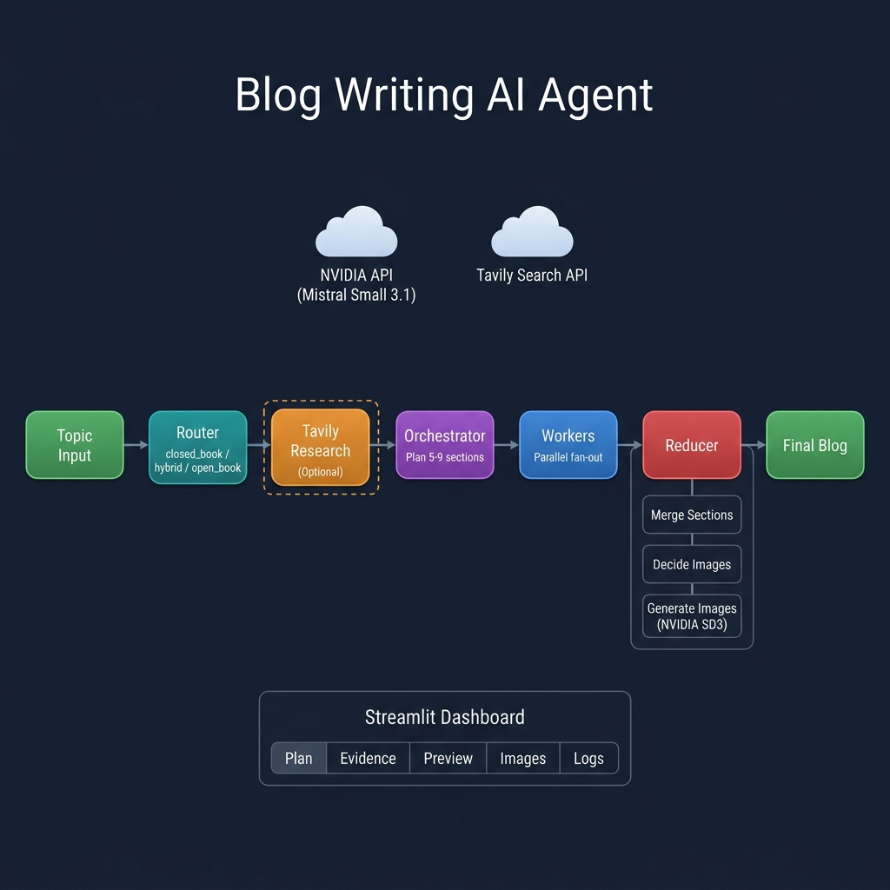

# 📝 AI Blog Writing Agent

> **An autonomous, multi-stage AI pipeline that transforms a topic into a fully-written, researched, and illustrated technical blog post — in a single click.**

Built with **LangGraph** (stateful multi-agent orchestration), **NVIDIA NIM APIs** (Mistral Small 3.1 24B for text, Stable Diffusion 3 Medium for images), **Tavily** for live web research, and a polished **Streamlit** dashboard.



---

## 📑 Table of Contents

- [Why This Project](#-why-this-project)
- [Key Features](#-key-features)
- [System Architecture](#-system-architecture)
- [Pipeline Deep Dive](#-pipeline-deep-dive)
- [Tech Stack](#-tech-stack)
- [Project Structure](#-project-structure)
- [Getting Started](#-getting-started)
- [Usage Guide](#-usage-guide)
- [Design Decisions & Engineering Highlights](#-design-decisions--engineering-highlights)
- [Development History](#-development-history)
- [Future Roadmap](#-future-roadmap)
- [License](#-license)

---

## 🎯 Why This Project

Content creation is one of the most time-consuming tasks in developer advocacy and technical marketing. This agent automates the entire blog-writing pipeline — from **topic analysis** and **real-time web research** to **structured planning**, **parallel section writing**, and **AI image generation** — reducing hours of work to minutes while maintaining professional quality.

**Key differentiator:** Unlike simple "generate a blog" prompts, this system uses a **multi-agent graph architecture** where specialized nodes handle routing, research, planning, writing, and illustration — each with domain-specific prompts and guardrails.

---

## ✨ Key Features

| Feature | Description |
|---------|-------------|
| 🧠 **Intelligent Routing** | Automatically determines if a topic needs live web research (`closed_book`, `hybrid`, or `open_book` mode) |
| 🔍 **Real-Time Web Research** | Integrates Tavily Search API for up-to-date evidence gathering with date-aware filtering |
| 📋 **Structured Planning** | Generates a detailed 5–9 section plan with goals, bullet points, word targets, and task metadata |
| ✍️ **Parallel Section Writing** | Fan-out architecture writes all sections concurrently for speed |
| 🖼️ **AI Image Generation** | Automatically decides where diagrams add value and generates them via NVIDIA Stable Diffusion 3 |
| 📊 **Interactive Dashboard** | Streamlit UI with tabs for Plan, Evidence, Markdown Preview, Images, and Logs |
| 💾 **Blog Library** | Saves generated blogs to disk and lets you reload past generations |
| 📦 **Export Options** | Download as Markdown or bundled ZIP (Markdown + images) |
| 🔧 **Robust JSON Parsing** | Multi-strategy JSON extraction with truncation repair for reliable LLM output handling |

---

## 🏗️ System Architecture

The agent is built as a **directed acyclic graph (DAG)** using LangGraph, with conditional edges and parallel fan-out:

```
                                    ┌─────────────────────┐
                                    │   NVIDIA NIM API     │
                                    │  Mistral Small 3.1   │
                                    │     (24B Instruct)   │
                                    └──────────┬──────────┘
                                               │
                                               ▼
┌──────┐    ┌────────┐    ┌──────────┐    ┌──────────────┐    ┌──────────┐    ┌─────────┐    ┌───────┐
│Topic │───▶│ Router │───▶│ Research │───▶│ Orchestrator │───▶│ Workers  │───▶│ Reducer │───▶│ Final │
│Input │    │        │    │ (Tavily) │    │   (Planner)  │    │(Fan-out) │    │         │    │ Blog  │
└──────┘    └────────┘    └──────────┘    └──────────────┘    └──────────┘    └─────────┘    └───────┘
                │              ▲                                                   │
                │   (optional) │                                                   │
                └──────────────┘                                          ┌────────┴────────┐
              closed_book skips                                           │  Reducer Sub-   │
              research entirely                                           │  graph (3 nodes)│
                                                                          │                 │
                                                                          │ 1. Merge Content│
                                                                          │ 2. Decide Images│
                                                                          │ 3. Generate &   │
                                                                          │    Place Images  │
                                                                          └─────────────────┘
```

### Graph Nodes

| Node | Type | Purpose |
|------|------|---------|
| **Router** | Conditional | Analyzes the topic and decides the research mode — `closed_book` (evergreen topics), `hybrid` (needs some fresh examples), or `open_book` (news/weekly roundups requiring full live data) |
| **Research** | Linear | Executes 3–10 scoped Tavily web searches, synthesizes results into structured `EvidenceItem` objects with URLs, dates, and snippets. Applies recency filtering (7 days for open_book, 45 days for hybrid) |
| **Orchestrator** | Linear | Produces a structured `Plan` with 5–9 `Task` objects — each with a title, goal, bullet points, word target, and metadata flags (`requires_research`, `requires_citations`, `requires_code`) |
| **Workers** | Fan-out (parallel) | Each worker receives one `Task` and writes a complete Markdown section. All workers execute concurrently via LangGraph's `Send` mechanism |
| **Reducer** | Subgraph | A 3-node subgraph: (1) **Merge** — orders and combines sections, (2) **Decide Images** — determines if/where diagrams should be placed, (3) **Generate & Place** — calls NVIDIA SD3 API, saves images, and inserts Markdown image references |

---

## 🔬 Pipeline Deep Dive

### Stage 1: Intelligent Routing

The Router node receives a topic and the current date, then classifies it into one of three modes:

- **`closed_book`** — Evergreen topics (e.g., "Self Attention in Transformers"). No web search. Recency window: ~10 years.
- **`hybrid`** — Mostly evergreen but benefits from fresh examples/tools (e.g., "Best Python ORMs in 2026"). Recency window: 45 days.
- **`open_book`** — Volatile/news topics (e.g., "This Week in AI"). Full web research required. Recency window: 7 days. Automatically forces `blog_kind = "news_roundup"`.

### Stage 2: Web Research (Conditional)

When research is needed, the system:
1. Generates 3–10 high-signal, scoped search queries
2. Executes each via Tavily's `advanced` search depth (up to 6 results per query)
3. Feeds raw results through an LLM to produce structured `EvidenceItem` objects
4. Deduplicates by URL and applies date-based filtering

### Stage 3: Orchestration (Planning)

The Orchestrator crafts a detailed blog outline:
- **5–9 structured tasks** with goals, 3–6 bullet points, and word targets (120–550 words each)
- **Metadata flags** per task: `requires_research`, `requires_citations`, `requires_code`
- **Blog-level metadata**: title, audience, tone, blog kind, constraints
- **Grounding rules**: `open_book` plans only reference evidence-backed claims; `hybrid` mixes evergreen with cited material

### Stage 4: Parallel Section Writing (Fan-out)

Each task is dispatched to an independent Worker node via LangGraph's `Send` API:
- Workers receive the full plan context, evidence, and their specific task
- Each worker outputs a complete Markdown section starting with `## Section Title`
- **Scope guards** prevent drift (e.g., news roundups won't produce tutorials)
- **Citation enforcement**: `open_book` sections must cite provided URLs; unsupported claims are flagged
- All workers run **concurrently**, dramatically reducing generation time

### Stage 5: Reduction & Image Generation

The Reducer is itself a 3-node subgraph:

1. **Merge Content** — Sorts sections by task ID, joins them, and prepends the blog title as `# Title`
2. **Decide Images** — An LLM reviews the blog and proposes up to 3 technical diagrams with prompts, alt text, and captions. Placeholders (`[[IMAGE_1]]`, etc.) are injected before section headers
3. **Generate & Place Images** — Calls the NVIDIA Stable Diffusion 3 Medium API to generate each image, saves to `output/images/`, and replaces placeholders with Markdown image references. Failures degrade gracefully with visible error blocks instead of breaking the document

---

## 🛠️ Tech Stack

| Layer | Technology | Purpose |
|-------|-----------|---------|
| **LLM** | [Mistral Small 3.1 24B Instruct](https://build.nvidia.com/mistralai/mistral-small-3-1-24b-instruct) via NVIDIA NIM | All text generation — routing, research synthesis, planning, section writing, image planning |
| **Image Generation** | [Stable Diffusion 3 Medium](https://build.nvidia.com/stabilityai/stable-diffusion-3-medium) via NVIDIA NIM | Technical diagram and illustration generation |
| **Agent Framework** | [LangGraph](https://github.com/langchain-ai/langgraph) ≥ 0.2.0 | Stateful DAG orchestration with conditional edges, fan-out/fan-in, and compiled subgraphs |
| **Web Research** | [Tavily](https://tavily.com/) Search API | Real-time web search with advanced search depth |
| **LLM Interface** | [LangChain](https://github.com/langchain-ai/langchain) (`langchain-openai`) | OpenAI-compatible chat interface to NVIDIA NIM |
| **Data Validation** | [Pydantic](https://docs.pydantic.dev/) v2 | Schema enforcement for all structured LLM outputs (`Plan`, `Task`, `RouterDecision`, `ImageSpec`, etc.) |
| **Frontend** | [Streamlit](https://streamlit.io/) ≥ 1.30 | Interactive dashboard with tabs, data tables, image rendering, and download buttons |
| **Language** | Python 3.10+ | Core runtime |

---

## 📁 Project Structure

```
blog-writing-agent-main/
│
├── bwa_backend.py          # Core LangGraph pipeline (816 lines)
│   ├── Pydantic schemas    #   Task, Plan, RouterDecision, EvidenceItem, ImageSpec, etc.
│   ├── LLM initialization  #   NVIDIA NIM API via ChatOpenAI (OpenAI-compatible)
│   ├── JSON repair engine   #   Multi-strategy extraction + truncation repair
│   ├── Router node          #   Topic classification (closed/hybrid/open_book)
│   ├── Research node        #   Tavily search + LLM synthesis + deduplication
│   ├── Orchestrator node    #   Structured plan generation (5-9 tasks)
│   ├── Worker node          #   Individual section writer with scope guards
│   ├── Reducer subgraph     #   Merge → Decide Images → Generate & Place
│   └── Graph compilation    #   StateGraph → conditional edges → compiled app
│
├── bwa_frontend.py         # Streamlit dashboard (486 lines)
│   ├── Stream helpers       #   try_stream() with fallback modes
│   ├── MD renderer          #   Custom Markdown renderer with local image support
│   ├── Blog management      #   Past blogs listing, loading, title extraction
│   └── UI layout            #   Sidebar + 5 tabs (Plan, Evidence, Preview, Images, Logs)
│
├── requirements.txt        # Python dependencies
├── .env.example            # API key template
├── .env                    # Your API keys (gitignored)
├── .gitignore              # Standard Python + project-specific ignores
├── assets/                 # Static assets (architecture diagram)
│   └── architecture.png
├── notebooks/              # Iterative development history (6 Jupyter notebooks)
│   ├── 1_bwa_basic.ipynb
│   ├── 2_bwa_improved_prompting.ipynb
│   ├── 3_bwa_research.ipynb
│   ├── 4_bwa_research_fine_tuned.ipynb
│   ├── 5_bwa_image.ipynb
│   └── tavily_test.ipynb
└── output/                 # Generated blogs & images (auto-created, gitignored)
    ├── *.md                # Markdown blog files
    └── images/             # Generated illustration PNGs
```

---

## 🚀 Getting Started

### Prerequisites

- **Python 3.10+**
- **NVIDIA NIM API Key** — Free tier available at [build.nvidia.com](https://build.nvidia.com/)
- **Tavily API Key** *(optional)* — For web research at [tavily.com](https://tavily.com/)

### Installation

```bash
# 1. Clone the repository
git clone https://github.com/Biswajeetray07/AI-Blog-Agent.git
cd AI-Blog-Agent

# 2. Create and activate a virtual environment
python -m venv .venv

# Windows:
.venv\Scripts\activate

# macOS / Linux:
# source .venv/bin/activate

# 3. Install dependencies
pip install -r requirements.txt

# 4. Configure environment variables
cp .env.example .env
# Edit .env with your API keys (see table below)

# 5. Launch the application
streamlit run bwa_frontend.py
```

### Environment Variables

| Variable | Required | Purpose |
|----------|----------|---------|
| `HUGGINGFACEHUB_API_TOKEN` | ❌ No | Legacy — not used in current NVIDIA-based stack |
| `TAVILY_API_KEY` | ⚡ Recommended | Enables live web research for `hybrid` and `open_book` topics |
| `GOOGLE_API_KEY` | ❌ No | Reserved for future integrations |
| `OPENAI_API_KEY` | ❌ No | Reserved for future integrations |

> **Note:** The NVIDIA NIM API keys for LLM and image generation are currently configured in `bwa_backend.py`. For production deployment, move these to `.env` variables.

---

## 📖 Usage Guide

### Generating a Blog

1. **Open the Streamlit app** at `http://localhost:8501`
2. **Enter a topic** in the sidebar text area
   - Evergreen: *"Self Attention in Transformers explained with code"*
   - Hybrid: *"Best Python Web Frameworks in 2026"*
   - News: *"This Week in AI — March 2026"*
3. **Set the as-of date** (defaults to today — affects recency filtering)
4. **Click 🚀 Generate Blog** and watch the pipeline progress in real-time

### Dashboard Tabs

| Tab | Contents |
|-----|----------|
| 🧩 **Plan** | Blog title, audience, tone, kind, and a data table of all tasks with their metadata |
| 🔎 **Evidence** | Table of research sources with titles, dates, publishers, and URLs |
| 📝 **Markdown Preview** | Full rendered blog with embedded images and download buttons |
| 🖼️ **Images** | Image plan JSON + gallery of generated illustrations |
| 🧾 **Logs** | Raw event log from the graph execution for debugging |

### Exporting

- **⬇️ Download Markdown** — Raw `.md` file
- **📦 Download Bundle** — ZIP archive containing the Markdown file + all generated images
- **⬇️ Download Images** — ZIP of just the generated illustrations

### Loading Past Blogs

Previously generated blogs are saved to `output/` and appear in the sidebar under **Past blogs**. Click any entry and **📂 Load selected blog** to view it.

---

## 💡 Design Decisions & Engineering Highlights

### 1. Multi-Agent Graph over Monolithic Prompt
Rather than a single massive prompt, each stage has a **specialized system prompt** with scope guards. This prevents prompt confusion, enables parallel execution, and makes each node independently testable and improvable.

### 2. Robust JSON Extraction Engine
LLMs frequently produce malformed JSON — wrapped in code fences, preceded by explanations, or truncated by token limits. The `_extract_json()` function implements a **4-tier extraction cascade**:
1. Direct `json.loads()`
2. Regex extraction from ` ```json ``` ` code fences
3. Outermost brace detection
4. Truncation repair (bracket/brace counting + auto-closing)

This is wrapped in `_llm_structured_call()` which retries up to 3 times with exponential backoff.

### 3. Conditional Research with Recency Filtering
The Router doesn't just decide *if* to research — it sets a **recency window** that propagates through the graph. Open-book blogs only see evidence from the last 7 days, preventing stale news from polluting roundups.

### 4. Fan-out / Fan-in via LangGraph Send
Worker nodes execute concurrently using LangGraph's `Send` primitive. Sections are collected via an `Annotated[List, operator.add]` reducer, ensuring all outputs are merged regardless of completion order.

### 5. Graceful Image Failure
If NVIDIA's image API fails for any spec, the system inserts a styled **fallback block** with the prompt, alt text, and error details — so the blog remains fully usable even without images.

### 6. Streaming with Fallbacks
The frontend's `try_stream()` function attempts three strategies in order:
1. LangGraph `stream(mode="updates")` — node-by-node progress
2. LangGraph `stream(mode="values")` — state snapshots
3. Simple `invoke()` — blocking single-shot

This ensures compatibility across LangGraph versions and graph configurations.

---

## 📓 Development History

The project was developed iteratively across 5 notebook stages, each building upon the previous:

| Notebook | Stage | What Was Added |
|----------|-------|----------------|
| `1_bwa_basic.ipynb` | Foundation | Basic Orchestrator → Worker → Reducer pipeline |
| `2_bwa_improved_prompting.ipynb` | Quality | Refined system prompts, structured `Task` Pydantic schemas |
| `3_bwa_research.ipynb` | Research | Router node + Tavily web search integration |
| `4_bwa_research_fine_tuned.ipynb` | Accuracy | Recency controls, date-aware evidence filtering, scope guards |
| `5_bwa_image.ipynb` | Visuals | Image planning + generation pipeline (reducer subgraph) |

The final production code in `bwa_backend.py` and `bwa_frontend.py` consolidates all notebook learnings into a clean, deployable application.

---

## 🗺️ Future Roadmap

- [ ] **Environment-based API keys** — Move all NVIDIA keys from source code to `.env`
- [ ] **Model selection UI** — Let users choose between LLM providers (NVIDIA, OpenAI, Anthropic)
- [ ] **SEO scoring** — Analyze generated content for keyword density, readability, and structure
- [ ] **Multi-language support** — Generate blogs in languages other than English
- [ ] **Template system** — Pre-defined blog templates (tutorial, comparison, case study)
- [ ] **Deployment** — Streamlit Cloud / Docker containerization
- [ ] **API mode** — REST API endpoint for programmatic blog generation
- [ ] **Human-in-the-loop** — Allow editing the plan before generation proceeds

---

## 📄 License

This project is for educational and demonstration purposes.

---

<p align="center">
  Built with ❤️ using LangGraph, NVIDIA NIM, Tavily, and Streamlit
</p>
